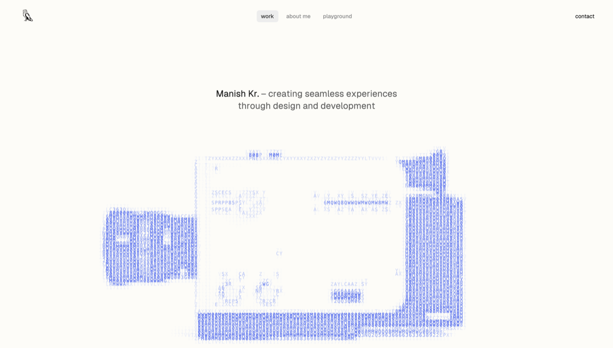

# Manish Kumar — Design Engineer Portfolio

An interactive portfolio focused on the space between design and engineering: crafted interfaces, motion systems, visual experiments, and product case studies.



## Highlights

- Responsive, motion-rich experience for desktop and mobile
- GSAP animation and Lenis smooth scrolling
- Progressive loading for image and video-heavy case studies
- Opt-in audio interactions powered by `@web-kits/audio`
- Reduced-motion support and effect-neutral production optimizations
- Vercel-ready build, caching, and security-header configuration

## Built with

- Semantic HTML and modern CSS
- JavaScript (ES modules)
- [Vite](https://vite.dev/)
- [GSAP](https://gsap.com/)
- [Lenis](https://lenis.darkroom.engineering/)

## Local development

This project requires Node.js 22.12 or newer.

```bash
npm ci
npm run dev
```

Create and inspect a production build:

```bash
npm run build
npm run preview
```

## Deployment

The project is configured for Vercel. The production build command is `npm run build`, and the generated output directory is `dist`.

Pushes to `main` are intended for production. Feature work should be developed on separate branches so Vercel can create preview deployments before merging.

## Project structure

```text
.
├── index.html       # Page structure and metadata
├── styles.css       # Responsive visual system
├── script.js        # Interactions, motion, and media lifecycle
├── public/          # Production media, fonts, and generated data
├── tools/           # Asset-generation and build utilities
└── vercel.json      # Vercel build, caching, and security headers
```

## Rights

© 2026 Manish Kumar. All rights reserved. The source is published for portfolio review; the visual work, media, and written content are not licensed for reuse.
